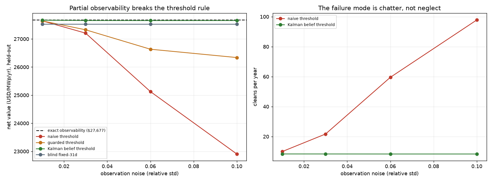

# RIMAL

**R**isk-aware **I**ntelligent **M**aintenance under **A**eolian **L**oading — *رمال, "sands"*

A reinforcement-learning benchmark for **photovoltaic soiling and cleaning dispatch in desert conditions**, calibrated to Dubai's Mohammed bin Rashid Al Maktoum Solar Park.

> **Status: complete.** Eight milestones, M0–M7. 143 tests.
> **[Read the findings →](FINDINGS.md)**

---

## The result

We built a simulator calibrated to DEWA's own published field measurements, reproduced the cleaning-interval optimum from the literature as a falsification gate, then tested four hypotheses about where adaptive control beats a well-tuned rule.

**Deep RL did not beat a well-tuned rule on any of them.**

> **The hard part of PV cleaning is state estimation, not control.** Once you know how
> dirty the panels are, the control law is a threshold. The largest effect anything here
> produced was a **17.6× reduction in soiling-estimate error** — from a Kalman filter,
> not a neural network.

| # | Hypothesis | Result |
|---|---|---|
| **M4** | a learned policy beats a fixed schedule | PPO beat every fixed interval (+$135), **lost to a tuned threshold** by $16 |
| **M5** | latent soiling breaks a threshold rule | Partial observability is devastating (**−$4,763**, 17.2%) — a Kalman filter fixes it; PPO still lost |
| **M6** | stochastic cleaning and actuator wear | Real but small ($190/yr); learning *which* robot to use lost everywhere |
| **M7** | fat-tailed storm risk | A real risk/return frontier exists — QR-DQN **lost** by $163, and its risk dial did nothing |

### The finding that transfers

Under the noisy performance-ratio signal a real plant actually measures, a naive threshold rule **collapses by 17.2% and cleans ~98 times a year instead of 8** — it fails by chatter, not neglect. From 3% noise upward a *blind calendar* beats the sensor-driven rule. Filtering removes the trap entirely.



---

## Quick start

```bash
git clone https://github.com/KartikJoshi23/Self-Learning-Agent.git
cd Self-Learning-Agent
python -m venv .venv && ./.venv/Scripts/activate    # Windows
pip install -r requirements.txt
pytest -q
```

Every milestone has an acceptance script that **declares its criteria before the milestone is built** and prints pass/fail per check:

```bash
python scripts/m0_verify.py    # data layer          11/11
python scripts/m1_verify.py    # physics             10/10
python scripts/m2_verify.py    # Gymnasium env       10/10
python scripts/m3_verify.py    # falsification gate   7/7
python scripts/m4_verify.py    # PPO                  5/5   (~1 h, trains 5 seeds)
python scripts/m5_verify.py    # partial observability
python scripts/m6_verify.py    # fleet + actuator wear
python scripts/m7_verify.py    # risk sensitivity + water CMDP
```

Checks are labelled `declared` (approved in the plan) versus `scrutiny` (harder bars we set ourselves). **A failing scrutiny check still turns the run red** — M6 and M7 both end red, and that is the honest result rather than a bug.

## What's in here

| Path | |
|---|---|
| `rimal/data` | NASA POWER fetchers, parquet cache, offline replay |
| `rimal/physics` | pvlib energy yield; Kimber, AOD-modulated and storm soiling |
| `rimal/env` | Gymnasium environment, observation noise, Kalman filter, robot fleet |
| `rimal/baselines` | fixed-interval, threshold, belief-threshold, fleet heuristics |
| `rimal/agents` | PPO (CleanRL style) and QR-DQN with CVaR action selection |
| `rimal/eval` | episode runner, CVaR, policy comparison, analytic optimum |
| `scripts/` | one acceptance script per milestone |

The environment is a low-dimensional stochastic simulator — thousands of steps per second on CPU. **No GPU. Zero cost.** All data is free and redistributable: [NASA POWER](https://power.larc.nasa.gov/) supplies irradiance, weather *and* aerosol optical depth with no registration.

## Honesty notes

[FINDINGS.md](FINDINGS.md) documents **six defects found in our own work**, each of which changed a result — a 24× rainfall unit error, a clipped soiling tail, a self-inflicted train/eval mismatch, an under-tuned baseline, an unfair comparison protocol, and a headline figure computed from three episodes. Two acceptance checks passed for the wrong reasons and were tightened; one then correctly failed.

For a negative result, that record *is* the credibility argument.

## Grounding

DEWA cleaning-robot field trial (164 modules, 445–505 W, Jul 2024 – Aug 2025): soiling 0.14–0.33 %/day, cleaning efficiencies 69–99%, documented battery overheating, corrosion, frame misalignment, UV degradation. DEWA Autonomous Soiling Detector (Dec 2025). IEA-PVPS Task 13. Global Solar Atlas PVOUT 1,791.5 kWh/kWp for Dubai. Nearest prior work: [arXiv:2603.07518](https://arxiv.org/abs/2603.07518).

## License

MIT.
