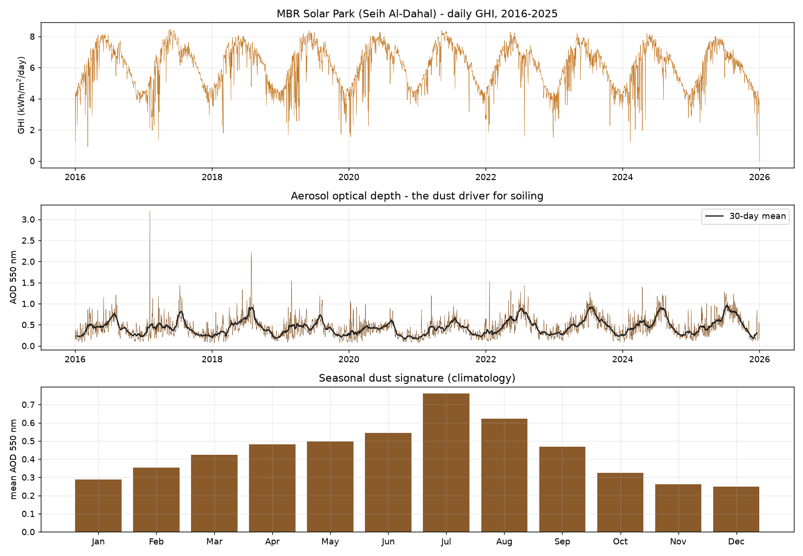

# RIMAL

**R**isk-aware **I**ntelligent **M**aintenance under **A**eolian **L**oading — *رمال, "sands"*

A reinforcement-learning benchmark and agent for **photovoltaic soiling and cleaning dispatch in desert conditions**, calibrated to Dubai's Mohammed bin Rashid Al Maktoum Solar Park.

> **Status:** Phase 4, milestone **M0 complete** (data layer verified). Tier 1 (M0–M4) approved and in progress.

---

## The problem

A desert solar plant loses energy to dust continuously, and cleaning costs money, water and machine wear. Deciding *when, where, and with which machine* to clean is a sequential decision problem under uncertainty — and the real version is considerably harder than the published formulations assume:

| | Assumed in prior work | Reality |
|---|---|---|
| **Soiling level** | Directly observable | **Latent.** Inferred from a noisy performance ratio confounded by irradiance, temperature, degradation and clipping. NREL's own SRR method is documented to falsely identify soiling in noisy signals. |
| **Cleaning effect** | Perfect reset to zero soiling | **Stochastic and heterogeneous.** DEWA measured cleaning efficiencies of **69–99%** across five robots. |
| **Cleaning machine** | Always available, always identical | **Itself degrading.** DEWA documented battery overheating, corrosion, frame misalignment and UV degradation over 13 months of field trials. |
| **Objective** | Risk-neutral expected cost | **Fat-tailed.** A shamal can undo a cleaning cycle overnight. |
| **Dynamics** | Stationary | **Seasonal and drifting.** Verified here: AOD peaks in July (0.76) and troughs in December (0.25) — a 3.0× seasonal amplitude. |

RIMAL models all five. It also ships, as far as we can determine, **the first public Gymnasium environment for PV soiling and cleaning scheduling** — a GitHub search for one returns no results.

## Why this plant

DEWA has already built the **sensing** layer (a patented Autonomous Soiling Detector) and is trialling the **actuation** layer (five autonomous cleaning robots). RIMAL targets the missing **decision** layer between them.

MBR Solar Park is the world's largest single-site solar park on the IPP model: **3,460 MW** commissioned across its first five phases, reaching **4,660 MW** on completion of phase 6 and **>5,000 MW by 2030**.

---

## Verified results so far

### M0 — data layer ✅

Ten years (2016–2025) of hourly irradiance, weather and **aerosol optical depth** at Seih Al-Dahal (24.75 °N, 55.35 °E), from NASA POWER. One API, no registration, no cost.



```
M0 ACCEPTANCE -- MBR Solar Park (Seih Al-Dahal), 2016-2025

  PASS  coverage >= 5 years: 10 distinct years, 10 requested
  PASS  hourly index is gapless: 87,672 rows, 0 duplicates
  PASS  no missing values after fill-value handling: 0 / 789,048 cells
  PASS  second fetch is byte-identical
  PASS  replays with network disabled: served fully from cache
  PASS  annual GHI in the published Dubai band: min 2137, max 2280 kWh/m2/yr
  PASS  ALLSKY never exceeds CLRSKY
  PASS  AOD peaks in late spring/summer: peak = Jul (0.760)
  PASS  AOD troughs in the winter quiet season: trough = Dec (0.250)
  PASS  seasonal amplitude is material: ratio = 3.04

M0 PASSED -- 10/10 checks
```

The seasonal dust signature is not an assumption — it is recovered from the data and matches the published UAE dust climatology (external-source dust peaking in summer, driven by the shamal).

---

## Quick start

```bash
git clone https://github.com/KartikJoshi23/Self-Learning-Agent.git
cd Self-Learning-Agent
python -m venv .venv && ./.venv/Scripts/activate    # Windows
pip install -r requirements.txt
```

Run the test suite:

```bash
pytest -q -m "not network"
```

Reproduce the M0 result (first run downloads ~25 s of data, then caches):

```bash
python scripts/m0_verify.py
```

---

## Roadmap

**Tier 1 — approved, in progress.** A working agent that beats fixed-interval cleaning on held-out years.

| | Milestone | Status |
|---|---|---|
| M0 | Data layer: NASA POWER fetchers, caching, seasonal validation | ✅ Complete |
| M1 | Physics: pvlib yield + Kimber soiling calibrated to DEWA's 0.14–0.33 %/day | ⬜ Next |
| M2 | Gymnasium environment v0 | ⬜ |
| M3 | Baselines + metric harness — **must reproduce the published 28–34 day optimum** | ⬜ |
| M4 | PPO agent beating every fixed-interval baseline on held-out years | ⬜ |

**Tier 2 (not yet approved)** — POMDP with belief filter; stochastic per-robot efficacy and actuator health; CMDP water budget and CVaR under injected shamals.
**Tier 3 (not yet approved)** — continual learning; offline RL with off-policy evaluation; public benchmark release.

M3 is the falsification gate for the whole project: if the simulator does not reproduce the cleaning-interval optimum reported in the literature, the simulator is wrong and no agent trained on it means anything.

---

## Method

The environment is a low-dimensional stochastic simulator, not a 3D physics engine — thousands of steps per second on CPU. **No GPU required, and the entire project runs at zero cost.**

Grounding for the concept, the evidence base and a full audit log of corrections live in [RESEARCH.md](RESEARCH.md). The milestone plan, design decisions and verification strategy live in [IMPLEMENTATION-PLAN.md](IMPLEMENTATION-PLAN.md).

Key references: IEA-PVPS Task 13 on soiling losses; Deceglie et al. on soiling extraction from PV yield (SRR); [arXiv:2505.17342](https://arxiv.org/abs/2505.17342) safe RL and CMDPs; [arXiv:2405.01718](https://arxiv.org/pdf/2405.01718) CVaR risk-sensitive RL; [arXiv:2506.21872](https://arxiv.org/pdf/2506.21872) continual RL; [arXiv:2311.18206](https://arxiv.org/pdf/2311.18206) SCOPE-RL for off-policy evaluation.

Nearest prior work is [arXiv:2603.07518](https://arxiv.org/abs/2603.07518) (Heungjo An, March 2026), which applies PPO and SAC to PV cleaning schedules in Abu Dhabi. RIMAL extends that line along the five axes in the table above; it does not claim to be first.

## Data

All data is free and redistributable. [NASA POWER](https://power.larc.nasa.gov/) serves irradiance, weather and AOD with no registration. Cached parquet files are git-ignored — regenerate them with the fetchers.

## Project conventions

This project follows a phase-gated workflow and a binding problem-solving methodology. Contributors and resumed sessions should read [HANDOFF.md](HANDOFF.md) and [PROGRESS.md](PROGRESS.md) first.

## License

MIT.
